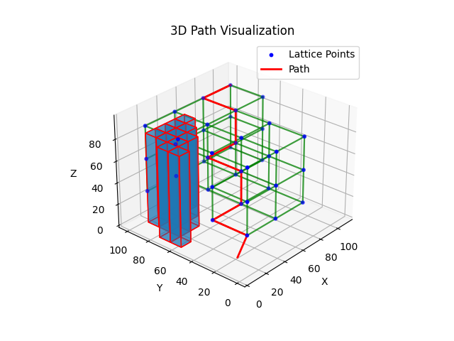
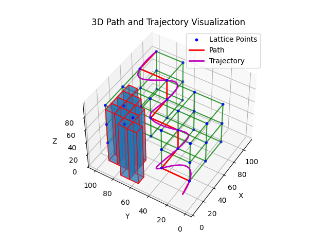

# Advanced 3D Motion Planning and Trajectory Generation for Autonomous Quadcopters

I developed a 3D motion planning system for a quadcopter using a comprehensive engineering design process. This involved coding components for obstacle parsing, lattice construction, A* pathfinding, and polynomial trajectory generation, integrated and tested rigorously through EnvData.cpp, Lattice.cpp, trajectory.cpp, and main.cpp. The project successfully generated and visualized efficient flight paths in a 3D environment, showcasing my ability to execute detailed design and implementation steps.

The following images typify the results of the project:





### Theory

#### Cubic Lattice Graph Structure and A* Pathfinding

I have implemented a cubic lattice graph structure to represent the 3D environment through which the quadcopter navigates. This structure provides a clear framework for the pathfinding algorithm to operate.

To find the shortest path from the current position to the target position, I employed the A* pathfinding algorithm. This algorithm is known for its efficiency, combining the strengths of Dijkstra's algorithm and a greedy best-first search. My implementation leverages the following cost function:

$$ f(n) = g(n) + h(n) $$

where:
- $g(n)$ is the cost from the start node to node $n$.
- $h(n)$ is the heuristic estimate of the cost from node $n$ to the goal, using the Euclidean distance.

By using the Euclidean distance as the heuristic, I ensured accurate and efficient navigation through the 3D cubic lattice, demonstrating my ability to apply advanced algorithmic concepts to practical problems.

#### Seventh-Order Polynomial Trajectory Planning

Once the pathfinding algorithm determines the waypoints, my custom trajectory planner code interpolates a piecewise continuous seventh-order polynomial trajectory through these waypoints. This approach ensures smooth transitions and minimizes the snap (the fourth derivative of position) for the quadcopter.

The core function of the trajectory planner is to transform any sequence of $N$ waypoints into a series of $N-1$ smooth trajectory segments. Each segment of the trajectory between waypoints is modeled as a seventh-order polynomial:

$$
p(t) = a_7 t^7 + a_6 t^6 + a_5 t^5 + a_4 t^4 + a_3 t^3 + a_2 t^2 + a_1 t + a_0
$$

where:
- $t$ is the time parameter.
- $a_0, a_1, \ldots, a_7$ are the polynomial coefficients determined for each segment.

The boundary conditions applied are:
- Complete rest (zero velocity, acceleration, jerk, and snap) at the initial waypoint, which translates to:

$$
p(0) = p_0, \quad \dot{p}(0) = 0, \quad \ddot{p}(0) = 0, \quad \dddot{p}(0) = 0, \quad \ddddot{p}(0) = 0
$$

- Complete rest (zero velocity, acceleration, jerk, and snap) at the final waypoint, which translates to:

$$
p(T) = p_T, \quad \dot{p}(T) = 0, \quad \ddot{p}(T) = 0, \quad \dddot{p}(T) = 0, \quad \ddddot{p}(T) = 0
$$

Here, $p_0$ and $p_T$ are the positions at the initial and final waypoints, respectively, and $T$ is the time taken to travel between these waypoints.

A significant challenge in creating the trajectory planning code was constructing the matrix system of equations needed to solve for the polynomial coefficients. This required determining the appropriate constraints and ensuring there were enough equations to match the number of unknown coefficients. For each trajectory segment, there are 8 unknown coefficients, necessitating 8 constraints per segment. This involved setting up continuity conditions for position, velocity, acceleration, jerk, and snap at each waypoint.

At each of the intermediate waypoints of the path, I enforced the continuity for the 0th to the 6th derivative.

- Continuity of position ($\mathbf{p}{(t)}$)
- Continuity of velocity ($\frac{d\mathbf{p}(t)}{dt}$)
- Continuity of acceleration ($\frac{d^2\mathbf{p}(t)}{dt^2}$)
- Continuity of jerk ($\frac{d^3\mathbf{p}(t)}{dt^3}$)
- Continuity of snap ($\frac{d^4\mathbf{p}(t)}{dt^4}$)
- Continuity of crackle ($\frac{d^5\mathbf{p}(t)}{dt^5}$)
- Continuity of pop ($\frac{d^6\mathbf{p}(t)}{dt^6}$)

The result of constructing a matrix-system from these boundary conditions and intermediate constraints is a system where each constraint is independent of the others, which is the reason why this trajectory planning module will reliably generate a series of $N-1$ trajectory segments that approximate a minimum snap trajectory from any series of $N$ waypoints generated from the graph-search path planning module. 

For an in-depth understanding, refer to the [Trajectory Planning Math](docs/trajectory_generation_math.md) file in this repository.

## Description

- **env_data.cpp/h**: Handles environment data including obstacles.
- **lattice.cpp/h**: Constructs a lattice for pathfinding.
- **main.cpp**: Main program that integrates obstacle parsing, lattice creation, pathfinding, and trajectory generation.
- **trajectory.cpp/h**: Generates polynomial trajectories from waypoints.
- **show_lattice.py**: Visualizes the lattice and obstacles.
- **show_path.py**: Visualizes the path found by the A* algorithm.
- **show_trajectory.py**: Visualizes the trajectory generated for the path.

### Dependencies

The project relies on several dependencies for both the C++ and Python components. Below is a list of the required libraries and their purposes.

#### C++ Dependencies

- **Eigen**: A C++ template library for linear algebra. It is used for matrix and vector operations, particularly in solving the polynomial coefficients.

To install Eigen, download it from the [official Eigen website](http://eigen.tuxfamily.org/).

#### Python Dependencies

- **Matplotlib**: A plotting library for creating static, animated, and interactive visualizations in Python.
- **Pandas**: A data manipulation and analysis library for Python. It provides data structures and functions needed to work with structured data seamlessly.

To install these Python libraries, you can use pip:
```bash
pip install matplotlib pandas
```

## Usage

1. **Compile the Project**:
   Compile the C++ files using a C++ compiler. Ensure that the Eigen library is accessible to the compiler.

   ```sh
   g++ src/*.cpp -Iheaders -IC:\path\to\eigen-3.4.0 -o bin/trajectory_planner.exe -std=c++11 -O2
    ```

    **Note**: Replace `C:\path\to\eigen-3.4.0` with the path to the Eigen library on your system.

2. **Run the Program**:
    Execute the compiled program to generate the trajectory.
    
    ```sh
    bin/trajectory_planner.exe
    ```

3. **Visualize the Results**:
    Run the Python scripts to visualize the lattice, path, and trajectory.

    ```sh
    python visualization/show_lattice.py
    python visualization/show_path.py
    python visualization/show_trajectory.py
    ```

4. **Try Different Scenarios**:

    Experiment with changing the separation distance of the lattice and the start and target positions to observe the impact on the generated trajectory.


